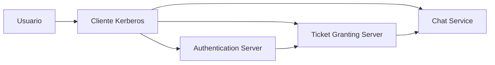
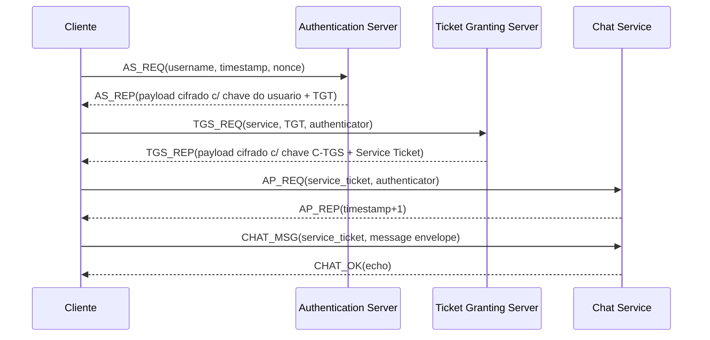

# Documentacao Completa do Projeto

## 1. Visao Geral do Projeto

Este projeto implementa, de forma educacional, dois cenarios complementares de seguranca em sistemas distribuídos:

1. Chat seguro cliente-servidor com autenticacao por desafio-resposta e protecao de mensagens.
2. Fluxo Kerberos simplificado com os papeis classicos AS (Authentication Server), TGS (Ticket Granting Server) e servidor de aplicacao (chat).

A proposta central e demonstrar, na pratica, como credenciais de usuario podem ser transformadas em autenticacao confiavel e como essa autenticacao evolui para autorizacao de acesso a servicos sem reenviar senha em cada etapa.

O sistema nao usa bibliotecas externas e foi construído apenas com a biblioteca padrao do Python, com foco em aprendizagem de fundamentos:

- Derivacao de chave a partir de senha
- Criptografia simetrica em modo CBC
- Integridade/autenticidade por HMAC
- Tickets temporarios com expiracao
- Mitigacao de replay com timestamp e nonce

## 2. Objetivo do Sistema

### 2.1 Objetivo Academico

Permitir que o aluno entenda o ciclo completo de autenticacao segura em dois niveis:

1. Nivel de sessao local de chat (login + canal seguro entre usuarios).
2. Nivel de autenticacao distribuida (Kerberos simplificado).

### 2.2 Objetivo Tecnico

Prover um ambiente de demonstracao onde seja possivel:

- Validar credenciais sem enviar senha em texto plano para o servidor de aplicacao.
- Emitir e consumir tickets temporarios.
- Estabelecer chaves de sessao especificas por contexto.
- Detectar adulteracao de mensagens.
- Mostrar autenticacao mutua (cliente e servidor validam um ao outro).

### 2.3 Escopo do Projeto

Inclui:

- Servicos em memoria (AS, TGS, chat service).
- Cliente Kerberos com cache de tickets/chaves.
- Chat seguro TCP com comandos interativos.
- Testes automatizados de criptografia e fluxo ponta a ponta.

Nao inclui:

- Persistencia real em banco de dados.
- Distribuicao real de processos em maquinas diferentes.
- Protocolo Kerberos completo RFC-compliant.
- Hardening para producao.

## 3. Tecnologias Utilizadas

### 3.1 Linguagem e Runtime

- Python 3.10+ (validado no ambiente local com Python 3.12.10).

### 3.2 Bibliotecas

Somente biblioteca padrao do Python:

- dataclasses
- hashlib
- hmac
- secrets
- base64
- json
- socket
- threading
- queue
- time
- unittest

### 3.3 Criptografia Implementada

- KDF: PBKDF2-HMAC-SHA256
- Cifra simetrica: Feistel educacional em CBC
- Integridade/autenticidade de envelope: HMAC-SHA256
- Comparacao segura: hmac.compare_digest

Observacao importante: a cifra Feistel e didatica e nao deve ser usada em producao.

## 4. Estrutura do Projeto

```text
Chat_Seguro_Fluxo_Kerberos/
  run.py
  test_integrity_demo.py
  src/
    authentication_server.py
    ticket_granting_server.py
    chat_server.py
    client.py
    secure_chat.py
    common.py
    config.py
    crypto/
      feistel.py
      kdf.py
      utils.py
  tests/
    test_crypto.py
    test_flow.py
```

## 5. Arquitetura do Sistema (Passo a Passo)

## 5.1 Componentes Principais

1. Authentication Server (AS)
2. Ticket Granting Server (TGS)
3. Servidor de Aplicacao (ChatService)
4. Cliente Kerberos
5. Servidor e cliente de chat interativo
6. Camada comum de envelopes/tickets
7. Camada criptografica

### 5.2 Visao Macro



### 5.3 Sequencia do Kerberos Simplificado



### 5.4 Explicacao passo a passo

1. O usuario informa login/senha no cliente.
2. O cliente deriva a chave de longo prazo localmente via PBKDF2.
3. Cliente envia AS_REQ com username, timestamp e nonce.
4. AS valida formato, frescor de timestamp e existencia do usuario.
5. AS gera chave de sessao C-TGS, encapsula em payload e cria TGT cifrado com chave do TGS.
6. Cliente decripta AS_REP com sua chave de longo prazo e armazena TGT + chave C-TGS.
7. Cliente envia TGS_REQ com TGT + authenticator cifrado com C-TGS.
8. TGS valida TGT, validade temporal, consistencia do usuario e replay de nonce.
9. TGS gera chave de sessao C-S, emite service ticket cifrado com chave do servico.
10. Cliente decripta TGS_REP (com C-TGS) e armazena service ticket + C-S.
11. Cliente envia AP_REQ ao servico com service ticket + authenticator cifrado com C-S.
12. Servidor valida ticket, validade, servico-alvo, replay e autenticador.
13. Servidor retorna AP_REP com evidência de autenticacao mutua (timestamp+1).
14. Cliente valida AP_REP e passa a enviar mensagens de chat protegidas.

## 6. Fluxo Completo de Funcionamento (Inicio ao Fim)

### 6.1 Modo 1 - Servidor de Chat Seguro (run.py opcao 1)

1. O programa monta stack KDC em memoria (AS, TGS e app server).
2. Sobe o SecureChatServer TCP em 127.0.0.1:9999.
3. Mantem usuarios de demonstracao em memoria (alice, bob, carol).
4. Aguardam-se conexoes de clientes.

### 6.2 Modo 2 - Cliente de Chat Seguro (run.py opcao 2)

1. Cliente abre socket TCP com servidor de chat.
2. Executa login por desafio-resposta:
- LOGIN(username)
- LOGIN_CHALLENGE(salt, nonce)
- LOGIN_PROOF(proof = HMAC(chave_usuario, nonce|username))
- LOGIN_OK(participantes)
3. Usuario pode listar usuarios, abrir canal seguro e trocar mensagens.
4. Ao abrir canal, o servidor gera channel_key e envia CHANNEL_READY cifrado para ambos.
5. Mensagens sao enviadas em envelope criptografado e autenticado.

### 6.3 Modo 3 - Fluxo Kerberos Completo (run.py opcao 3)

1. Cliente executa AS_REQ/AS_REP.
2. Cliente executa TGS_REQ/TGS_REP.
3. Cliente executa AP_REQ/AP_REP.
4. Cliente autenticado envia CHAT_MSG para ChatService.
5. ChatService retorna CHAT_OK.
6. Menu permite renovacao de ticket e envio continuo sem reenviar senha.

### 6.4 Fluxo de Dados Sensiveis

- Senha: apenas no cliente para derivar chave.
- Chaves de sessao: trafegam cifradas em envelopes apropriados.
- Ticket: sempre encapsulado em envelope com chave da entidade destinataria.
- Mensagem de chat: trafega cifrada com chave de sessao do canal/servico.

## 7. Descricao Minuciosa de Cada Componente

### 7.1 src/config.py

Centraliza parametros globais:

- Enderecos e portas de AS, TGS e Chat
- Limite de skew temporal
- TTL de TGT e service ticket
- Numero de iteracoes PBKDF2
- Tamanho de chave
- Principals padrao

Impacto: qualquer alteracao aqui afeta comportamento de autenticacao, validade e conectividade.

### 7.2 src/crypto/kdf.py

Responsabilidades:

1. derive_key(password, salt, iterations, key_size)
- Deriva chave simetrica de senha com PBKDF2-HMAC-SHA256.

2. stretch_key_material(base_key)
- Expande base_key em duas chaves:
- enc_key (cifragem)
- mac_key (integridade)

Beneficio: separacao de funcao criptografica de chave (encrypt vs MAC).

### 7.3 src/crypto/feistel.py

Implementa cifra educacional:

- Bloco de 8 bytes
- Rede Feistel com rounds padronizados (minimo 1000)
- Modo CBC
- Padding PKCS7

Funcoes principais:

- encrypt_block / decrypt_block
- encrypt_cbc / decrypt_cbc

Observacao: a seguranca pratica nao equivale a algoritmos modernos auditados (AES-GCM, ChaCha20-Poly1305 etc.).

### 7.4 src/crypto/utils.py

Fornece utilitarios essenciais:

- Geração de nonce e bytes aleatorios
- Base64 encode/decode
- Serializacao JSON canonica
- HMAC SHA-256
- Comparacao segura
- Timestamp atual

Esses helpers padronizam serializacao e validacao em todo o protocolo.

### 7.5 src/common.py

Camada de protocolo comum:

1. is_timestamp_fresh
- Verifica frescor temporal contra limite de skew.

2. make_ticket
- Construtor padronizado de TGT e service ticket.

3. encrypt_envelope
- Serializa objeto JSON canonico
- Cifra com enc_key
- Concatena IV + ciphertext
- Calcula HMAC sobre body
- Retorna envelope {body, mac}

4. decrypt_envelope
- Recalcula e compara MAC
- Se MAC valido, decripta body
- Desserializa payload

5. ticket_valid
- Verifica janela [issued_at, expires_at]

Observacao: o envelope combina confidencialidade, integridade e autenticidade de origem da chave.

### 7.6 src/authentication_server.py

Papel: autenticar principal e emitir TGT.

Fluxo interno de handle_as_req:

1. Validar tipo de mensagem AS_REQ.
2. Validar campos obrigatorios e tipos.
3. Verificar timestamp fresco.
4. Verificar existencia do usuario.
5. Gerar chave C-TGS e montar TGT.
6. Cifrar TGT com chave do TGS.
7. Montar payload para cliente com nonce de correlacao.
8. Cifrar payload com chave de longo prazo do usuario.
9. Retornar AS_REP.

### 7.7 src/ticket_granting_server.py

Papel: converter TGT em service ticket para servico-alvo.

Fluxo interno de handle_tgs_req:

1. Validar tipo TGS_REQ e formato.
2. Validar existencia do servico solicitado.
3. Decriptar TGT com chave do TGS.
4. Verificar validade do TGT e audiencia (service == tgs@local).
5. Extrair chave C-TGS do TGT.
6. Decriptar authenticator com C-TGS.
7. Validar formato do authenticator.
8. Validar username consistente com TGT.
9. Validar frescor temporal.
10. Bloquear replay por nonce unico.
11. Gerar chave C-S.
12. Montar service ticket cifrado para o servico.
13. Montar payload TGS_REP cifrado com C-TGS.
14. Retornar TGS_REP.

### 7.8 src/chat_server.py

Papel: servidor de aplicacao protegido por ticket.

Metodos principais:

1. handle_ap_req
- Valida ticket de servico
- Valida authenticator
- Confere username e freshness
- Bloqueia replay por nonce
- Retorna AP_REP com timestamp+1

2. handle_chat_msg
- Valida ticket ainda vigente
- Decripta mensagem com C-S
- Valida payload
- Armazena no historico interno
- Retorna CHAT_OK

### 7.9 src/client.py

Papel: cliente Kerberos com cache de estado.

Estado mantido em ClientCache:

- tgt
- c_tgs_session_key
- service_ticket
- c_s_session_key

Operacoes principais:

- make_as_req / process_as_rep
- make_tgs_req / process_tgs_rep
- make_ap_req / process_ap_rep
- make_chat_message

Decisao de projeto: separacao clara entre "gerar mensagem" e "processar resposta" facilita entendimento pedagogico e testes unitarios.

### 7.10 src/secure_chat.py

Contem dois grandes blocos:

1. SecureChatServer
- Login desafio-resposta
- Sessao por usuario logado
- Abertura de canal seguro P2P mediado
- Reenvio de mensagens cifradas entre pares

2. SecureChatClient
- Login interativo
- Thread receptora de eventos assincronos
- Armazenamento local de canais e historico
- Envio de mensagens com opcao tamper (demonstracao de integridade)

Ponto didatico importante: CHANNEL_READY e enviado em envelope cifrado com chave de longo prazo do usuario, garantindo distribuicao protegida da chave de canal.

### 7.11 run.py

Ponto de entrada da aplicacao:

- Menu principal com 3 modos
- Construcao de usuarios demo
- Construcao da stack KDC
- Execucao guiada do fluxo Kerberos com impressao estruturada de pacotes

Tambem inclui funcoes de apoio para resumir envelopes sem expor conteudo completo sensivel no terminal.

### 7.12 test_integrity_demo.py

Script de demonstracao automatica:

1. Inicializa servidor
2. Loga alice e bob
3. Abre canal seguro
4. Envia mensagem integra
5. Envia mensagem adulterada
6. Verifica alertas/resultado esperado

### 7.13 tests/test_crypto.py

Valida:

- Roundtrip encrypt/decrypt na cifra CBC
- Determinismo e tamanho da chave PBKDF2

### 7.14 tests/test_flow.py

Valida fluxo completo:

- AS_REQ/AS_REP
- TGS_REQ/TGS_REP
- AP_REQ/AP_REP
- CHAT_MSG/CHAT_OK

## 8. Integracoes Entre Sistemas

### 8.1 Integracoes Internas

O projeto integra seus proprios subsistemas:

1. Cliente Kerberos <-> AS
2. Cliente Kerberos <-> TGS
3. Cliente Kerberos <-> ChatService
4. SecureChatClient <-> SecureChatServer (TCP)

### 8.2 Integracoes Externas

Nao ha integracao com sistemas terceiros (APIs externas, banco externo, IAM corporativo etc.).

## 9. Regras de Negocio

1. Usuario deve existir para autenticar no AS e no chat.
2. Timestamp deve estar dentro de janela aceita (anti-replay temporal).
3. Nonce nao pode se repetir no TGS/ChatService para o mesmo contexto.
4. TGT so e valido para o principal do TGS.
5. Service ticket so e valido para o servico destinatario.
6. Ticket expirado invalida acesso.
7. Usuario nao pode abrir canal consigo mesmo no chat interativo.
8. Canal e invalidado quando um usuario desconecta.
9. Mensagem com MAC invalido e rejeitada.
10. Usuario so envia mensagem se pertencer ao canal.

## 10. Estrutura de Dados e Banco de Dados

## 10.1 Modelo de Persistencia

Nao existe banco de dados persistente. Todo estado e mantido em memoria de processo.

Consequencias:

- Reiniciar processo limpa tickets, sessoes, nonces e historico.
- Simplicidade didatica aumenta, mas nao ha durabilidade.

### 10.2 Estruturas de Dados Principais

1. UserRecord (AS e chat)
- username: str
- long_term_key: bytes
- salt: bytes (no chat seguro)

2. Ticket (dict)
- ticket_type: TGT ou SERVICE
- username
- service
- issued_at
- expires_at
- session_key (base64)

3. Envelopes criptograficos
- body: base64(IV + ciphertext)
- mac: HMAC-SHA256 hex

4. Cache do cliente Kerberos
- TGT, service ticket e respectivas chaves de sessao

5. Estado de sessoes online (SecureChatServer)
- _sessions: username -> ConnectionState

6. Estado de canais (SecureChatServer)
- _channels: channel_id -> ChannelRecord

7. Controle de replay
- used_nonces: set[str] em TGS e ChatService

### 10.3 Exemplo de Envelope

```json
{
  "body": "BASE64_IV_E_CIPHERTEXT",
  "mac": "hex_hmac_sha256"
}
```

### 10.4 Exemplo de Ticket (antes de cifrar)

```json
{
  "ticket_type": "SERVICE",
  "username": "alice",
  "service": "chat@local",
  "issued_at": 1751712000,
  "expires_at": 1751712600,
  "session_key": "BASE64_KEY"
}
```

## 11. Exemplos Praticos de Uso

### 11.1 Executar menu principal

```bash
python run.py
```

### 11.2 Iniciar servidor e cliente de chat em terminais separados

Terminal 1:

```bash
python run.py
# opcao 1
```

Terminal 2:

```bash
python run.py
# opcao 2
```

Credenciais demo:

- alice / alice123
- bob / bob123
- carol / carol123

### 11.3 Executar fluxo Kerberos guiado

```bash
python run.py
# opcao 3
```

### 11.4 Executar demonstracao automatica de integridade

```bash
python test_integrity_demo.py
```

### 11.5 Executar testes automatizados

```bash
python -m unittest discover -s tests -v
```

Resultado observado no ambiente local durante a elaboracao desta documentacao:

- 3 testes executados
- 3 testes aprovados
- Sem falhas

## 12. Possiveis Cenarios de Execucao

### 12.1 Cenario Feliz Kerberos

1. Usuario valido.
2. AS_REQ aceito.
3. TGS_REQ aceito.
4. AP_REQ aceito.
5. Mensagem entregue.

### 12.2 Credencial Invalida no Chat Interativo

- LOGIN_PROOF divergente do esperado.
- Servidor responde erro de credenciais invalidas.

### 12.3 Replay no TGS

- Nonce repetido no authenticator.
- TGS rejeita com replay detected.

### 12.4 Ticket Expirado

- ticket_valid retorna falso.
- Servico/TGS rejeitam operacao.

### 12.5 Mensagem Adulterada

- HMAC nao confere em decrypt_envelope.
- Mensagem rejeitada por integridade comprometida.

### 12.6 Peer Offline em Canal de Chat

- Canal invalido ou peer desconectado.
- Servidor retorna erro de usuario fora do canal/offline.

## 13. Pontos de Atencao e Decisoes Tecnicas

### 13.1 Decisoes Tecnicas

1. Criptografia didatica manual
- Escolhida para aprendizado de fundamentos.

2. Chaves separadas para cifragem e MAC
- Evita uso da mesma chave para finalidades distintas.

3. JSON canonico
- Garante serializacao deterministica para MAC.

4. Estado em memoria
- Reduz complexidade para ambiente didatico.

5. Thread receptora no cliente de chat
- Permite recepcao assincrona de eventos (CHANNEL_READY, INCOMING_MESSAGE).

### 13.2 Riscos/Limitacoes

1. Feistel custom nao substitui cifradores padrao industriais.
2. Nao ha persistencia nem recuperacao de estado.
3. Nonces de replay ficam apenas na memoria da instancia.
4. Nao ha controle refinado de autorizacao por recurso.
5. Nao ha rotacao de chaves de longo prazo com governance formal.

### 13.3 O que seria necessario para producao

1. Substituir cifra por algoritmo padrao auditado (AES-GCM/ChaCha20-Poly1305).
2. Persistir principals, tickets e trilhas de auditoria em storage seguro.
3. Adotar TLS mutual para canal de transporte.
4. Implementar politicas de revogacao e rotacao de chaves.
5. Inserir observabilidade, rate limit e monitoramento de abuso.
6. Revisao criptografica e testes de seguranca especializados.

## 14. Mapa de Mensagens do Protocolo

### 14.1 Kerberos Simplificado

- AS_REQ
- AS_REP
- TGS_REQ
- TGS_REP
- AP_REQ
- AP_REP
- CHAT_MSG
- CHAT_OK
- ERROR

### 14.2 Chat Interativo

- LOGIN
- LOGIN_CHALLENGE
- LOGIN_PROOF
- LOGIN_OK
- LIST_USERS
- LIST_USERS_OK
- OPEN_CHANNEL
- OPEN_CHANNEL_OK
- CHANNEL_READY
- SEND_MESSAGE
- SEND_MESSAGE_OK
- INCOMING_MESSAGE
- LOGOUT
- LOGOUT_OK
- ERROR

## 15. Como Ler o Codigo de Forma Didatica (Roteiro para Professor)

Ordem sugerida para compreensao rapida e profunda:

1. src/config.py
- Entender parametros globais de seguranca e rede.

2. src/crypto/utils.py e src/crypto/kdf.py
- Entender utilitarios de base e derivacao de chave.

3. src/crypto/feistel.py
- Entender confidencialidade no nivel de bloco/CBC.

4. src/common.py
- Entender envelope, ticket e validacoes reutilizaveis.

5. src/authentication_server.py
- Entender emissao de TGT.

6. src/ticket_granting_server.py
- Entender emissao de service ticket e anti-replay.

7. src/chat_server.py
- Entender validacao de AP_REQ e chat protegido.

8. src/client.py
- Entender cache de estado e sequencia do cliente.

9. src/secure_chat.py
- Entender login interativo, canais e troca de mensagens.

10. run.py + testes
- Entender demonstracao integrada e validacao automatizada.

## 16. Conclusao

O projeto cumpre o objetivo educacional de demonstrar autenticacao segura e emissao de credenciais temporarias no estilo Kerberos, alem de apresentar um chat com confidencialidade, integridade e autenticidade no nivel de aplicacao.

A implementacao foi desenhada para clareza didatica e experimentacao controlada. Ela nao pretende substituir stacks de seguranca de producao, mas oferece uma base consistente para ensino, avaliacao academica e evolucoes futuras.
